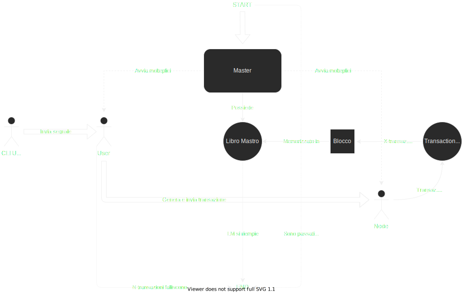

# simulazione_transazioni

Programma sviluppato per il progetto di Sistemi Operativi del corso di laurea in informatica, presso l'Università degli
studi di Torino anno 2021/2022.

## Compilazione e uso

Per compilare il programma è necessario avere installato sulla propria macchina linux `gcc` e `make`.

Nella cartella [configs](/configs) ci sono degli script per avviare il programma: basta scaricare il progetto, fare il
comando `make` nella cartella principale del progetto (verrà creato l'eseguibile `master`), ed infine avviare uno degli
script dalla cartella in cui è presente l'eseguibile (per esempio, `./configs/conf1.sh`)

## Funzionamento

